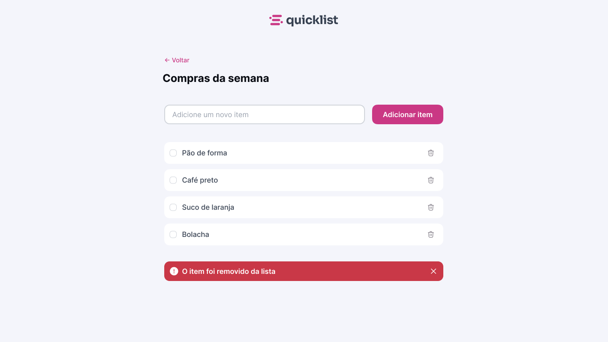

<p align="center">
    
</p>


## 📋 Sobre o projeto

O **Quicklist** é um desafio prático desenvolvido durante a formação front-end. O objetivo é criar uma aplicação funcional para gerenciar itens de uma lista de compras semanal, aplicando os fundamentos de HTML, CSS e JavaScript.

## ✨ Funcionalidades

- ✅ **Adicionar itens** — Digite o nome e clique em "Adicionar item"
- ✅ **Marcar como concluído** — Checkbox com texto riscado ao marcar
- ✅ **Remover itens** — Botão de lixeira com animação de saída
- ✅ **Toast de feedback** — Notificação aparece após cada remoção
- ✅ **Validação de input** — Impede campo vazio e itens duplicados
- ✅ **Itens pré-cadastrados** — Lista começa com 4 itens de exemplo
- ✅ **Estado vazio** — Mensagem ilustrada quando a lista está sem itens
- ✅ **Responsivo** — Funciona em desktop e mobile

## 🖥️ Preview do Projeto




## 🗂️ Estrutura do projeto

```
lista-compras/
├── index.html   # Estrutura semântica da página
├── style.css    # Estilos, design system e responsividade
├── script.js    # Lógica da aplicação em JavaScript puro
└── README.md    # Documentação do projeto
```

## 🚀 Como executar

Por ser um projeto com HTML, CSS e JavaScript puro, **não precisa de instalação ou build**.

1. Clone o repositório:
   ```bash
   git clone https://github.com/seu-usuario/lista-compras.git
   ```

2. Acesse a pasta:
   ```bash
   cd lista-compras
   ```

3. Abra o arquivo `index.html` no navegador — ou use a extensão **Live Server** no VS Code para recarregamento automático.

## 🛠️ Tecnologias utilizadas

| Tecnologia | Uso |
|---|---|
| **HTML5** | Estrutura semântica com `<form>`, `<ul>`, `<li>`, ARIA |
| **CSS3** | Design system com variáveis, Flexbox, animações e media queries |
| **JavaScript ES6+** | Manipulação do DOM, eventos, estado da aplicação |
| **Google Fonts – Inter** | Tipografia moderna e legível |

## 🎨 Decisões de design

- **Paleta de cores:** Rosa carmim `#C9184A` como cor primária, fundo neutro `#F0F2F5`
- **Tipografia:** Fonte Inter para leitura clara em qualquer tamanho de tela
- **Animações:** `slide-in` ao adicionar e `slide-out` ao remover itens
- **Toast:** Notificação com mola (`cubic-bezier`) e fechamento automático em 4 segundos
- **Checkbox customizado:** Visual circular com checkmark em SVG via `background-image`

## 📱 Responsividade

A aplicação adapta o layout automaticamente para telas menores que **560px**:

- O formulário passa de linha única para coluna
- Input e botão ocupam **100% da largura**
- Altura padronizada em **52px** para facilitar o toque
- `appearance: none` garante comportamento consistente em iOS/Android

## 👩‍💻 Autora

Feito com 💜 por **Gelzieny R. Martins**

[](https://linkedin.com/in/gelzieny)
[](https://github.com/Gelzieny)

---

<p align="center">Desenvolvido como parte da formação front-end 💜</p>
